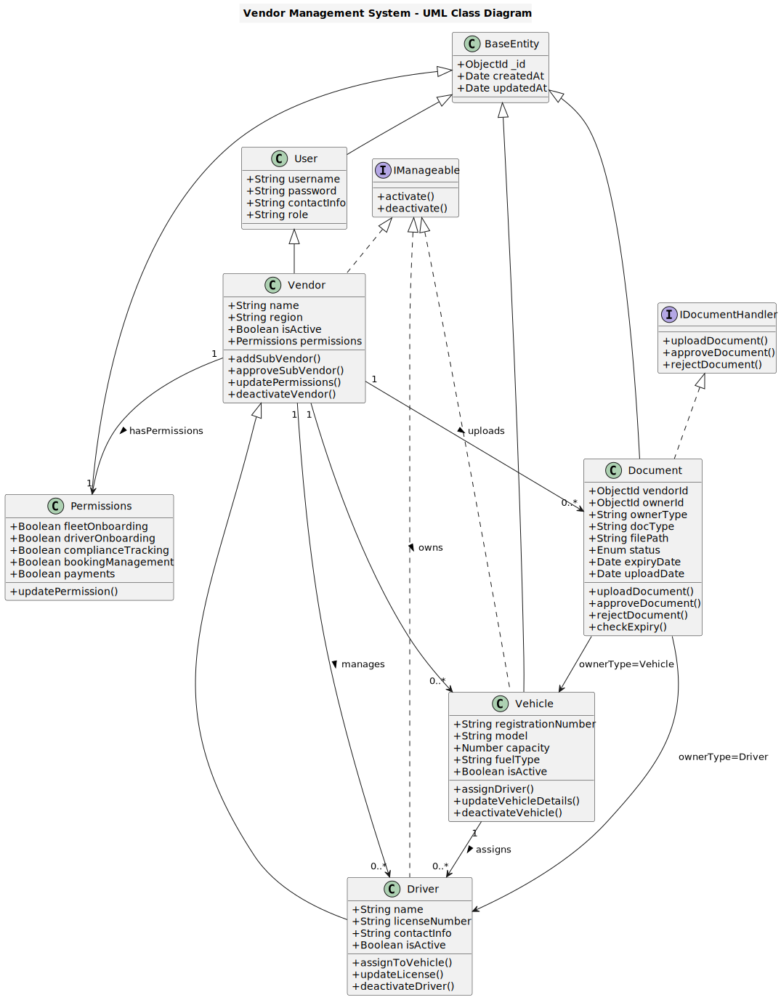
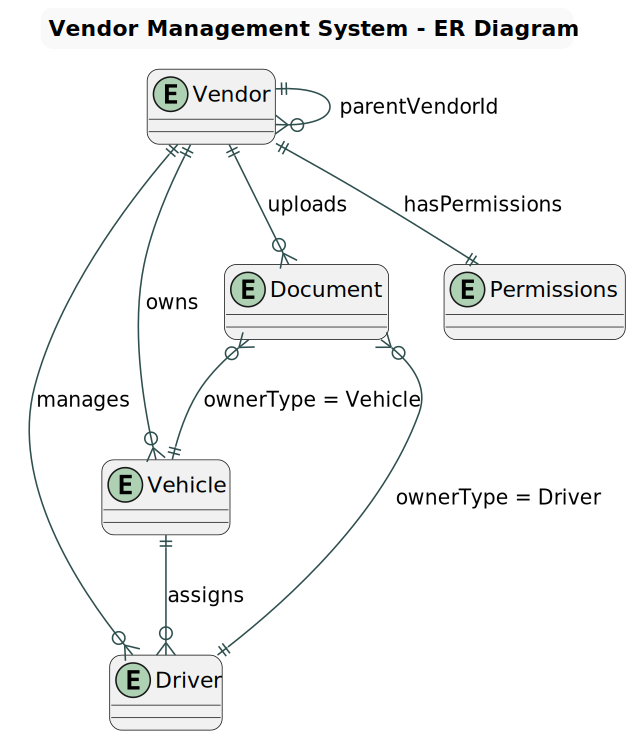

# Vendor Cab and Driver Onboarding & Hierarchical Management System

## Case Study Title
**Vendor Cab and Driver Onboarding & Multi-Level Vendor Hierarchy Management System**

---

## Abstract

This project presents a **multi-tier Vendor Cab and Driver Onboarding System** designed to streamline multi-level vendor management, vehicle onboarding, document verification, and hierarchical access control.

The system allows **Super Vendors** and **Sub Vendors** to manage fleets, onboard drivers, and track compliance while maintaining a clear hierarchical structure and controlled delegation of authority. It is built for scalability and role-based security.

---

## Objectives

1. Enable seamless onboarding of vehicles and drivers across vendor levels.  
2. Implement structured **role-based hierarchical access control (RBAC)**.  
3. Provide **document compliance tracking** for regulatory documents.  
4. Allow **SuperVendors** to delegate and control permissions for subvendors.  
5. Deliver a real-time, analytics-based dashboard for monitoring operations.

---

## Technology Stack

| Layer | Technology | Purpose |
|-------|-------------|----------|
| **Frontend** | HTML, CSS, JavaScript | Lightweight UI for dashboards and dynamic interactions. |
| **Backend** | Node.js (Express.js) | Asynchronous, modular, and scalable REST API framework. |
| **Database** | MongoDB (Atlas) | Flexible NoSQL model supporting nested vendor hierarchies. |
| **Authentication** | JWT (JSON Web Tokens) | Stateless authentication with role validation. |
| **File Uploads** | Multer | Handles multipart/form-data for document uploads. |
| **Security** | bcrypt.js | Secure password hashing. |

**Why this stack?**  
The Node.js + MongoDB environment provides flexibility for hierarchical data relationships and rapid API development. MongoDB’s document-based structure is ideal for storing vendors and their nested entities (vehicles, drivers, and documents).

---

## System Architecture
```t
SuperVendor
├── RegionalVendor
│ ├── CityVendor
│ │ └── LocalVendor
│ └── CityVendor
└── RegionalVendor
└── CityVendor
```

Each level forms a **parent-child relationship** defined by `parentVendorId`, ensuring traceable delegation of authority and access control.

---

## Key Features

### 1. Multi-Level Vendor Hierarchy
- Supports SuperVendor → Regional → City → Local structure.  
- Parent-child linking using `parentVendorId` for each subvendor.  
- SuperVendor can view and manage all subordinate vendors.

### 2. Role-Based Access Control (RBAC)
- Defined roles:
  - SuperVendor – Full system control  
  - Regional/City/LocalVendor – Limited, permission-based access
- Permission flags control access to:
  - Fleet onboarding
  - Driver onboarding
  - Compliance tracking
  - Booking management
  - Payments

### 3. Fleet Onboarding
- Register and manage vehicles (registration number, model, capacity, fuel type).  
- Each vehicle linked to a vendor (`vendorId`).  
- Fleet details visible to higher-level vendors.

### 4. Driver Onboarding
- Add drivers and assign vehicles.  
- Store license and contact details.  
- Assignment optional for flexible workflow.

### 5. Compliance Document Management
- Upload and store driver or vehicle documents (DL, RC, Permit, Pollution Certificate).  
- Metadata includes:
  - `ownerType` (`Driver` or `Vehicle`)  
  - `ownerId`  
  - `docType`, `expiryDate`, `status`
- Expired documents automatically marked as **Expired**.
- Supports document verification workflow (Pending → Approved/Rejected).

### 6. SuperVendor Dashboard
- Centralized dashboard displaying:
  - Subvendor details and permission management  
  - Fleet and driver counts  
  - Document status summary  
  - Compliance rate visualization (via Chart.js)

### 7. Compliance Analytics
- Calculates:
  - Total documents
  - Approved / Pending / Rejected / Expired
  - Compliance rate = (Approved / Total) × 100
- Data presented in a pie-chart summary.

### 8. Permission Delegation
- Manageable via `permissions-dashboard.html`.  
- SuperVendor can enable or disable specific permissions for subvendors.  
- Permissions updated securely via `/api/vendors/set-permissions`.

### 9. Secure Authentication
- Login system using JWTs stored in `localStorage`.  
- Middleware ensures protected routes validate both role and token.  
- Passwords stored using **bcrypt.js** for security.

---

## Database Schema

### Vendor Schema
```js
{
  name: String,
  username: String,
  password: String,
  contactInfo: String,
  role: ["SuperVendor", "RegionalVendor", "CityVendor", "LocalVendor"],
  region: String,
  parentVendorId: ObjectId (ref: "Vendor"),
  isActive: Boolean,
  permissions: {
    fleetOnboarding: Boolean,
    driverOnboarding: Boolean,
    complianceTracking: Boolean,
    bookingManagement: Boolean,
    payments: Boolean
  }
}
```
Vehicle Schema
```js
{
  registrationNumber: String,
  model: String,
  capacity: Number,
  fuelType: String,
  vendor: ObjectId (ref: "Vendor"),
  isActive: Boolean
}
```

Driver Schema
```js
{
  name: String,
  licenseNumber: String,
  contactInfo: String,
  vendorId: ObjectId (ref: "Vendor"),
  assignedVehicle: ObjectId (ref: "Vehicle"),
  isActive: Boolean
}
```

Document Schema
```js
{
  vendorId: ObjectId (ref: "Vendor"),
  ownerId: ObjectId,
  ownerType: "Driver" | "Vehicle",
  docType: String,
  filePath: String,
  status: "Pending" | "Approved" | "Rejected" | "Expired",
  expiryDate: Date,
  uploadDate: Date
}
```
## Diagrams
<!-- Class Diagram -->


<!-- Detailed ER Diagram -->



## Important Definitions
Term | Explanation |
|---------| ----------------------------|
Vendor Hierarchy | Parent-child vendor model allowing structured management across multiple levels. |
RBAC | Role-Based Access Control – ensures access to features based on user roles and permissions. |
JWT (JSON Web Token) | Compact, signed token used for authenticating API requests securely without sessions. |
Multer	Node.js middleware | for processing multipart/form-data, used for document uploads. |
MongoDB Atlas | Cloud-hosted database solution for MongoDB, ensuring availability and scalability. |

## Workflow Summary

1. SuperVendor Login → Access management and dashboards.
2. Create SubVendor → Assign roles and permissions.
3. SubVendor Login → Manage fleet, drivers, and upload documents.
4. Document Verification → SuperVendor reviews and approves or rejects.
5. Compliance Dashboard → Tracks document expiry, status, and compliance rates.

## Outcomes

- Streamlined onboarding and compliance management.
- Clear authority and responsibility delegation across vendor levels.
- Enhanced visibility and centralized oversight for SuperVendors.
- Scalable system structure suitable for real-world fleet networks.

## Future Enhancements
- Compliance Blocking – Automatically disable expired or non-compliant vehicles and drivers.
- Override Actions – Allow SuperVendor to manually disable subvendor entities.
- Alert System – Email/SMS notifications for expiring documents.
- Payment & Booking Modules – Extend functionality into full fleet operations.
- Predictive Analytics – Advanced compliance trend visualization.

## Project Setup & Installation Guide
#### Prerequisites:
- Node.js and npm installed
- MongoDB Atlas account
- Basic understanding of Express and REST APIs

### Steps
#### 1. Clone the repository
git clone https://github.com/<your-username>/vendor-onboarding-system.git

#### 2. Navigate into the project
cd vendor-onboarding-system

#### 3. Install dependencies
npm install

#### 4. Create a .env file and configure:
JWT_SECRET=your_secret_key
MONGODB_URI=your_mongodb_connection_string
PORT=5000

#### 5. Start the server
npm start

## Project Structure
```t
├── controllers/
│   ├── vendor.controller.js
│   ├── vehicle.controller.js
│   ├── driver.controller.js
│   └── document.controller.js
├── models/
│   ├── vendor.model.js
│   ├── vehicle.model.js
│   ├── driver.model.js
│   └── document.model.js
├── routes/
│   ├── vendor.routes.js
│   ├── vehicle.routes.js
│   ├── driver.routes.js
│   └── document.routes.js
├── middleware/
│   ├── auth.middleware.js
│   └── role.middleware.js
├── public/
│   ├── super-dashboard.html
│   ├── sub-dashboard.html
│   ├── compliance.html
│   ├── super-compliance.html
│   └── permissions-dashboard.html
└── server.js
```
